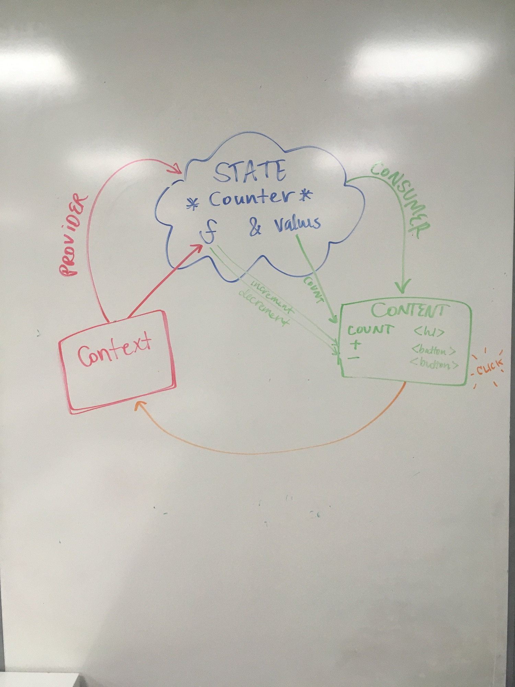

# React Context Counter App

This is a simple counter app written using React context to store and manage state across components in place of redux.

## Author: Caity Heath & Hannah Ingham

---

### Modules
##### `count-context.js`
Creates and provides context for child components, including state and methods.

##### `count-content.js`
Consumes the context of the count-context component.

##### `app.js`
Wraps and renders context and content components. 

--- 

### Running the App

* Clone or fork this repository.
* `npm install` to install node dependencies
* `npm start` will open a page in the browser which will let you interact with the app. 

---

### Tests

* Tests assert that the
    * App renders without crashing.
    * The count component renders
    * The count component increments and decrements
    

